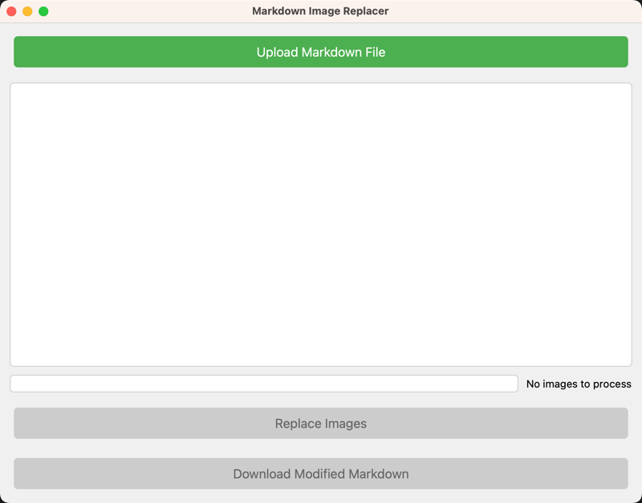
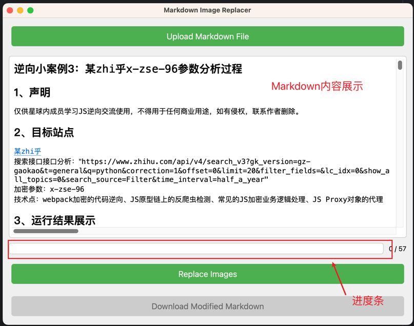
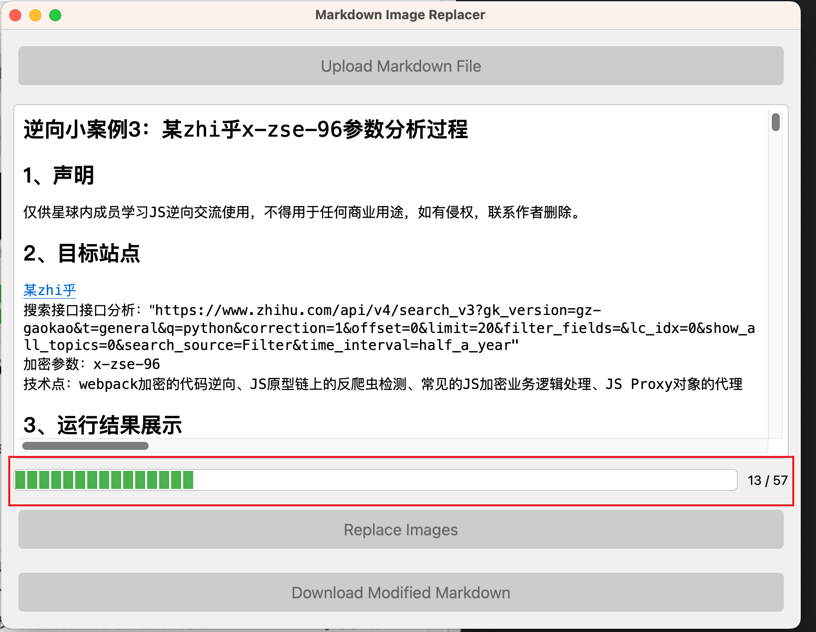
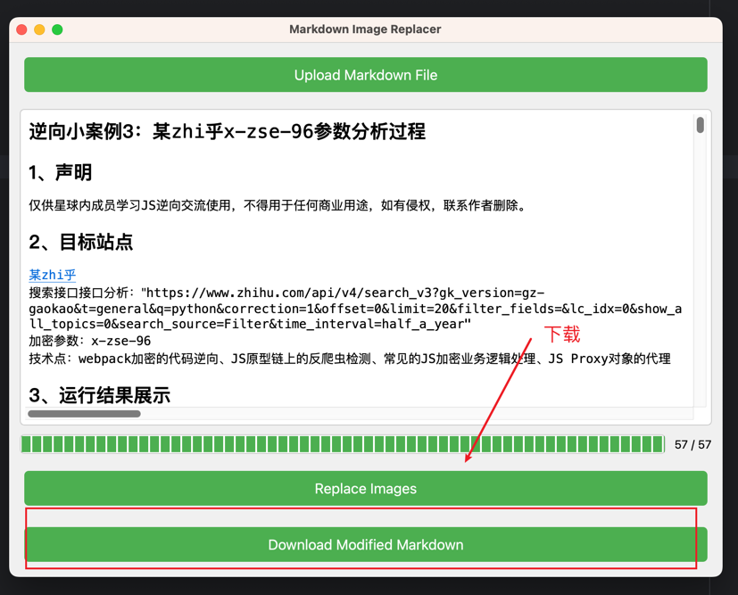
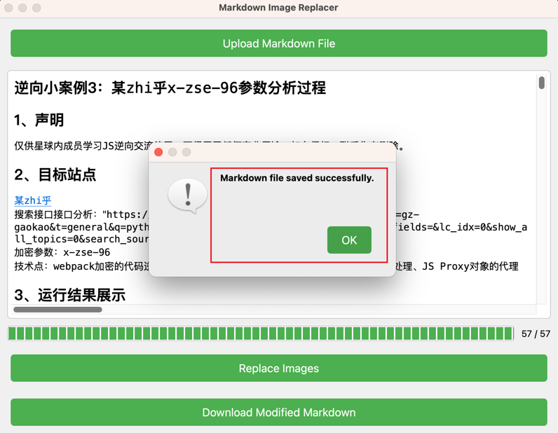

# MarkdownImageTools
Mardown图片处理工具, 当前的功能主要是将Markdown中的图片替换成其他平台网络图片, 以便于快捷的将Markdown内容粘贴发布到网上。

### 页面介绍
#### 1. 主页面

#### 2. 基本功能

#### 3. 上传过程

#### 4. 下载Markdown

 

### 待办事项
- [x] 基本UI代码+其他代码封转完成
- [x] 本地图片上传
- [x] 知识星球上传图片支持
- [ ] Markdown网络图片下载并重新上传到另一平台 
- [ ] 阿里云OSS上传图片支持
- [ ] 七牛云OSS上传图片支持

### 其他

大部分代码都是由 `Claude 3.5 Sonnet` AI编写，我只是充当了一个提示器的角色。
